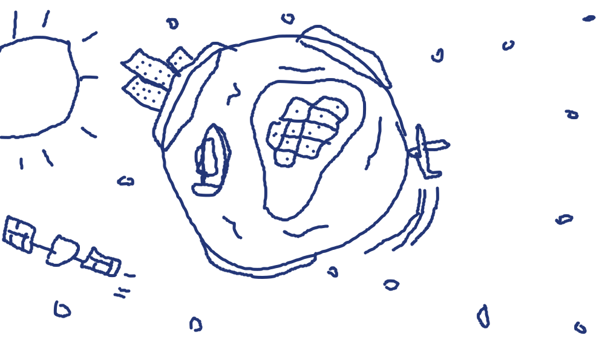
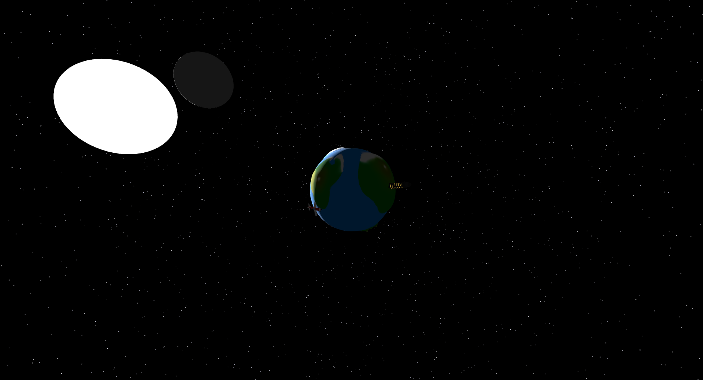

# Project Status Summary: Little Planet

**Author:** Gonçalo Ribau (119560)  
**Course:** Introduction to Computer Graphics (2025/2026)  

---

## 1. Project Links
* **GitHub Repository:** https://github.com/gRibau/ICG-Project
* **Run Project:** https://gribau.github.io/Little-Planet-ICG/

## 2. Illustrative Images

<!-- ### * Initial sketch
 -->

### * Current state

## 3. Objectives
The project consists on a caricature of earth, unrealistic but stylish style (at least I'm trying), with unrealistical proportions and various types of interactions. It's not really a game, more like an interactive experience. There are various points this project aims to fulfill:
* Building a satisfactory space like environment;
* Modeling of a earth-like planet with the proper texture and color. The terrain will be 3D (with the use of a greyscale heightmap);
* Adding traces of civilization like a plane, a cargo ship, a satellite and maybe others;
* Adding various other models, like a ufo and a sea monster (basically everything that comes to mind that sounds fun);
* Making the environment and models interactive, like being able to pilot the plane (with the keyboard, maybe have a minigame with it) or being able to click some models to play some kind of animation (with the mouse).

## 4. Completed Work
* **Rendering Pipeline and Camera:** Scene, perspective camera, WebGL renderer, OrbitControls, and responsive resize handling are fully set up. Shadow rendering is enabled with PCFSoftShadowMap.
* **Planet Surface and Relief:** The planet is implemented with color and height textures, high-resolution sphere geometry, and displacement mapping to create visible terrain depth.
* **Space Environment:** A procedural starfield (10k points) was added and kept centered on the camera to preserve the deep-space effect while moving.
* **Celestial System and Motion:** The moon and planet are modeled with shadows enabled, and a modular animation updates planetary spin and a tilted moon orbit.
* **Lighting:** A calibrated directional light + ambient light setup simulates sunlight, including shadow-map tuning to cover the planet and moon orbit.
* **World Assets on the Sphere:** A custom skyscraper model with emissive windows is placed on the planet using latitude/longitude-to-3D placement logic and surface-normal alignment.
* **Dynamic Day/Night Windows:** Window materials transition smoothly between cool daylight and warm night illumination based on sun direction relative to surface normal.
* **Plane Model and Interaction:** A custom propeller plane is integrated with orbit flight animation, speed/turn/lane controls (keyboard), click-to-select interaction, and a follow camera mode.
* **Project Structure:** The codebase is modularized by concern (objects, environment, animations, interactions), with dedicated reusable modules for each feature.

## 5. Pending Tasks

### * Improvements
* **Planet Surface:** Improvement to the heightmap and texture image;
* **General Models:** Improving models (like the plane, or maybe even importing them) and adding textures to them (like the moon, maybe even a heightmap);
* **Animations:** Improvement of the smoothness of some animations.
* **Code:** Cleaning and improving the code's efficiency (position calculation and shadow usage, for example). 

### * Additions
* **Models:** Addition of new models that complement this environment (cargo ship, satellite, cow, trees, more houses and city buildings, pyramids, ufo, sea monster)
* **Interactions and Animations:** Addition of new interactions and animations to existing and future models (ship sinking, sea monster appearing, ufo stealing the cow, sun exploding, etc...)